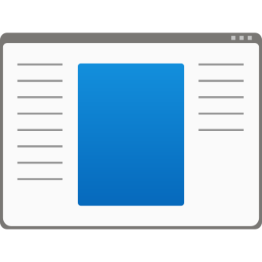

  

  # hgvcuj.exe

  
  
  

hgvcuj.exe is a **DESTRUCTIVE** trojan for Windows, written in C++.

> NOTE: The developers of hgvcuj.exe are not responsible for any damage caused to your device. Use at your own risk.

***DO NOT*** run hgvcuj.exe on actual hardware. This trojan overwrites the Windows logon. Test only in a Virtual Machine or on old hardware that you do not care about.
You will still be able to recover your files, but your windows install will be ***DEAD***.

> NOTE: This trojan was not mean to be used as a weapon. hgvcuj.exe is an experimental trojan and is only meant to be runned in a Virtual Machine or a testing environment.